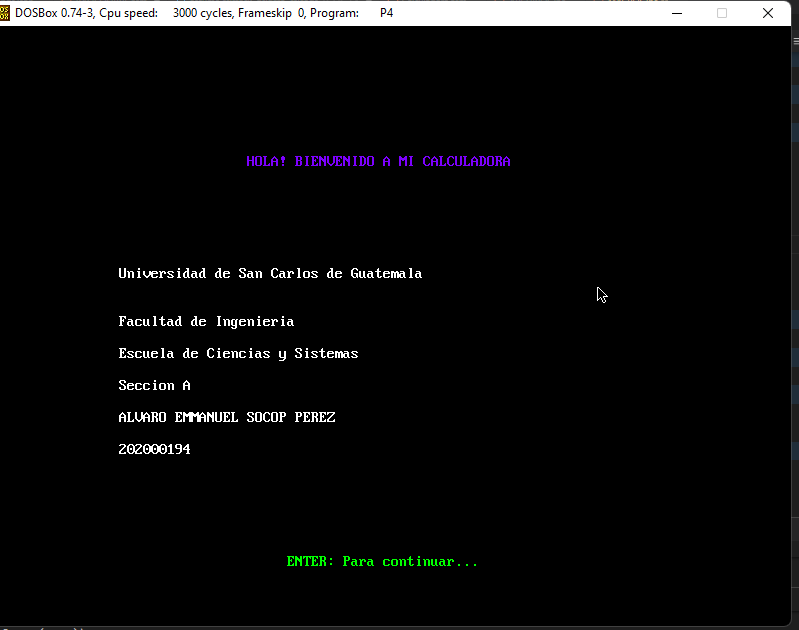
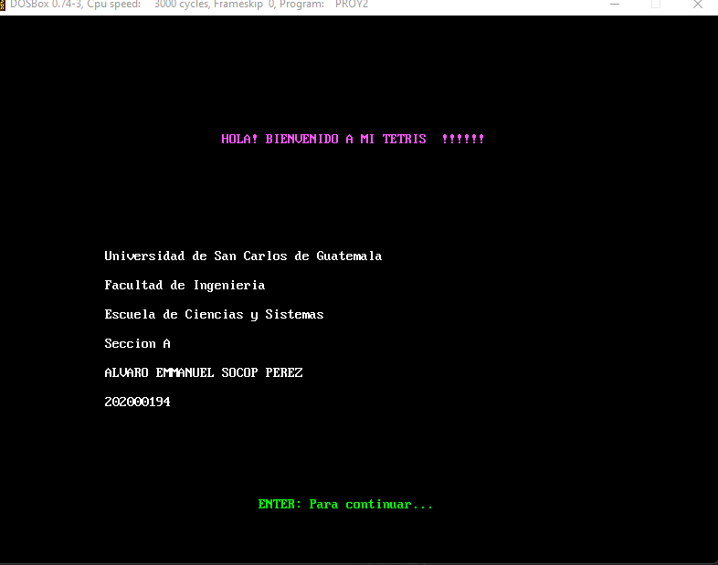
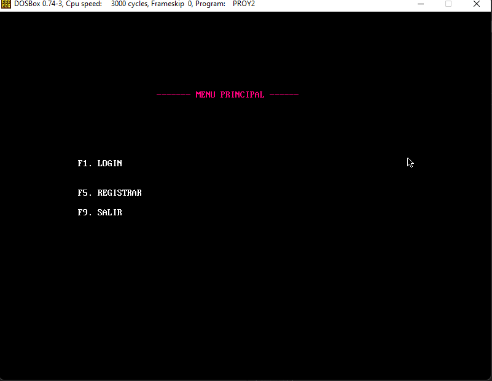
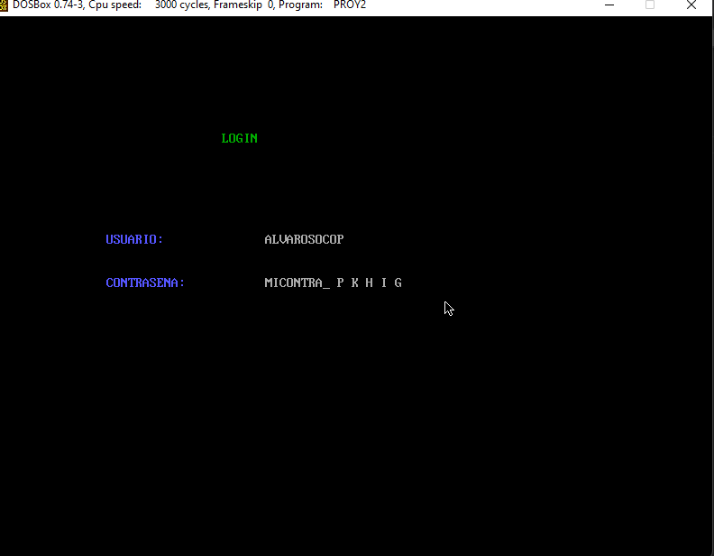
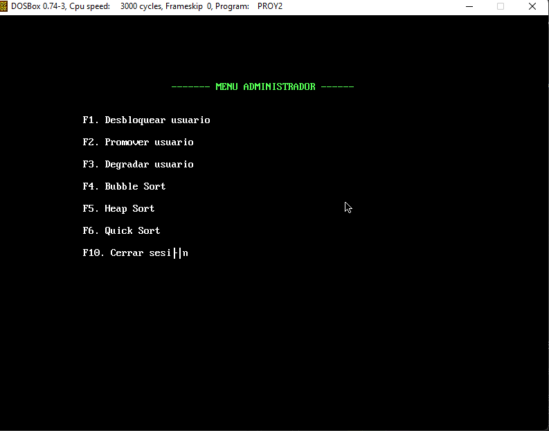

UNIVERSIDAD DE SAN CARLOS DE GUATEMALA

FACULTAD DE INGENIERIA

ESCUELA DE CIENCIAS Y SISTEMAS

LABORATORIO DE ARQUITECTURA DE COMPUTADORES Y ENSAMBLADORES 1

SEGUNDO SEMESTRE 2022

ING. OTTO RENE ESCOBAR LEIVA

TUTOR ACADEMICO SECCION A. OSCAR PERALTA

---

---

---

---

---

---

---

 <h1>PRACTICA #3</h1> 

 <h1>CALCULADORA</h1> 

---

---

---

---

| Nombre   |      Carnet      |  
|----------|:-------------:|
| Alvaro Emmanuel Socop Pérez | 202000194 | 

---

---

---

---

---

---

---

---

---

# MANUAL DE USUARIO
Este documento contiene toda la información sobre los recursos utilizados por el programa para poder jugarlo, explicando todo el trabajo que se ha realizado al crear el juego de Laberinto el uso adecuado que usted como usuario debe darle , explicado paso a paso.

>“Programa desarrollado en ASSEMBLER.                                                                                                                .”
## ÍNDICE

| Topico | Link |
| ------ | ------ |
| Introducción | [Ir](#intro) |
| Información del sistema | [Ir](#inf) |
| Objetivos y alcances del sistema| [Ir](#ob) |
| Información del Sistema requerido | [Ir](#sis) |
| Sistema Operativo | [Ir](#sis) |
| Tecnologías utilizadas | [Ir](#tech) |
| Interfaz del programa | [Ir](#inter) |
| Conclusiones | [Ir](#Conclu) |
## INTRODUCCIÓN
El presente manual de usuario tiene como finalidad describir la estructura y diseño del programa CALCULADORA BASICA que se realizo como parte de Practica 4, así como dar explicación hacia los usuarios de como pueden ejecutar y USAR la calculadora en su casa. El sistema cuenta con implementación de varias librerías propias de Arduino Online como parte del conocimiento adquirido en los laboratorios de arquitectura de ensambladores y computadores 1, en base a ello tratarémos de explicar como ejecutar la calculadora para poder disfrutarlo.

## Informacion del Sistema
Una calculadora básica es un aparato electrónico que nos ayuda a realizar las tareas mas comunes en cuanto a cálculo se refiere, la calculadora básica ofrece las operaciones más habituales como suma, resta, multiplicación y división, además suelen incluir para calcular porcentajes y algunos botones de memoria para realizar operaciones con resultados anteriores.

- La calculadora de fuentes de alimentación es una calculadora que nos ayudará a la hora de elegir una fuente de alimentación ideal para nuestro PC, en ella introducimos los componentes que tenemos, calcula el consumo que tienen estos componentes, y nos ofrece un resultado en vatios para que, como mínimo, deba tener nuestra fuente de alimentación. 

- La notación polaca inversa, notación de postfijo, o notación posfija (en inglés, Reverse Polish Notation, o RPN), es un método algebraico alternativo de introducción de datos. Su nombre viene por analogía con la relacionada notación polaca, una notación de prefijo introducida en 1920 por el matemático polaco Jan Łukasiewicz en donde cada operador está antes de sus operandos. En la notación polaca inversa es al revés: primero están los operandos y después viene el operador que va a realizar los cálculos sobre ellos. Tanto la notación polaca como la notación polaca inversa no necesitan usar paréntesis para indicar el orden de las operaciones, mientras la aridad del operador sea fija.

- Expresiones en notaciones infija, prefija y sufija — Solución de problemas con algoritmos y estructuras de datos.
 - Las notaciones sirven de base para expresar sentencias bien definidas. El uso más extendido de las notaciones sirve para expresar operaciones aritméticas. Las expresiones aritméticas se pueden expresar de tres formas distintas: infija, prefija y postfija.
## Objetivos y alcances del sistema

### Objetivo General
- Que el estudiante aplique los conocimientos adquiridos en el curso sobre el lenguaje ensamblador

### Objetivos Específicos
- Aplicar el conocimiento de operaciones básicas a nivel ensamblador.
- Conocer el funcionamiento de las interrupciones.
- Comprender el uso de la memoria en los programas escritos en ensamblador.
- Aplicar el manejo de archivos a bajo nivel.
- Comprender el uso de registros bandera.

## Especificaciones del Sistema requerido

### Requisitos de Hardware
|  |  |
| ------ | ------ |
|Memoria mínima|	512 MB|
|Memoria recomendada |	1 GB|
|Espacio en disco mínimo|	250 MB de espacio libre  |
|Espacio en disco recomendado	|  500 MB de espacio libre|
|MVP	|Visual Studio Code y MASM instalados |

### Requisitos de software
## Sistema operativo 
Windows
-	Windows 10 (8u51 y superiors)
-	Tener instalado el programa de Proteus y Librerias de Arduino Code u otro editor
-	RAM: 128 MB
-	Espacio en disco: 124 MB 
-	Procesador: Mínimo Pentium 2 a 266 MHz 
-	Algún explorador de internet Mac OS X 
-	Tener instalado el programa Visual Studio Code y DOSBOX con MASM
-	Explorador de 64 bits 
-	Se requiere un explorador de 64 bits (Safari, Firefox, por ejemplo) para ejecutar Oracle Java en Mac OS X. Linux
-	Oracle Linux 5.5+1 
-	Oracle Linux 6.x (32 bits), 6.x (64 bits)2 
-	Exploradores: Firefox
-	Arduino
-	Proteus

## Tecnologías 
- Assembler es tipo de programa informático que se encarga de traducir un fichero fuente escrito en un lenguaje ensamblador, a un fichero objeto que contiene código máquina, ejecutable directamente por el microprocesador.

- MASM es El Microsoft Macro Assembler (MASM) es un ensamblador para la familia x86 de microprocesadores. Fue producido originalmente por Microsoft para el trabajo de desarrollo en su sistema operativo MS-DOS, y fue durante cierto tiempo el ensamblador más popular disponible para ese sistema operativo. 

## Interfaz Utilizada
En la interfaz utilizada podemos encontrar diferentes enlementos que nos ayudan con el funcionamiento integro del juego, entre los cuales podemos encontrar los siguientes: 

- AREA DE ENTRADA DE BARCOS: Igresara los barcos por medio de coordenadas mostradas y su posicion en el tablero
- INICIO DEL JUEGO: se muestran 2 planos los cuales muestran los disparos realizados y barcos en el tablero
- FIN DEL JUEGO: se muestra quien es el ganador de la partida

  

  

  

  

  

## Conclusiones

- Como conclusión podemos decir que el lenguaje ensamblador es mas que un tipo de lenguaje de bajo nivel en el cual es empleado para crear programas informáticos.

- •La importancia de este es que en el se pueden hacer cualquier tipo de programas que en otros lenguajes de alto nivel no, al igual que ocupan menos espacio en la memoria.

- Este lenguaje es creado a base de instrucciones para intentar sustituir al lenguaje maquina por uno similar utilizado por el hombre.

- ¿Qué es un operador infijo?
La notación de infijo es la notación común de fórmulas aritméticas y lógicas, en la cual se escriben los operadores entre los operandos en que están actuando (ej. 2 + 2) usando un estilo de infijo.