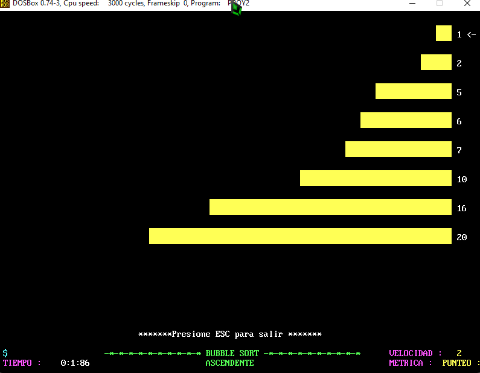

UNIVERSIDAD DE SAN CARLOS DE GUATEMALA

FACULTAD DE INGENIERIA

ESCUELA DE CIENCIAS Y SISTEMAS

LABORATORIO DE ARQUITECTURA DE COMPUTADORES Y ENSAMBLADORES 1

SEGUNDO SEMESTRE 2022

ING. OTTO RENE ESCOBAR LEIVA

TUTOR ACADEMICO SECCION A. OSCAR PERALTA

---

---

---

---

---

---

---

 <h1>PROYECTO #2</h1> 

 <h1>JUEGO DEL TETRIS</h1> 

---

---

---

---

| Nombre   |      Carnet      |  
|----------|:-------------:|
| Alvaro Emmanuel Socop Pérez | 202000194 | 

---

---

---

---

---

---

---

---

---

# MANUAL DE USUARIO
Este documento contiene toda la información sobre los recursos utilizados por el programa para poder jugarlo, explicando todo el trabajo que se ha realizado al crear el juego de Tetris el uso adecuado que usted como usuario debe darle , explicado paso a paso.

>“Programa desarrollado en ASSEMBLER MASM.                                                                                                                .”
## ÍNDICE

| Topico | Link |
| ------ | ------ |
| Introducción | [Ir](#intro) |
| Información del sistema | [Ir](#inf) |
| Objetivos y alcances del sistema| [Ir](#ob) |
| Información del Sistema requerido | [Ir](#sis) |
| Sistema Operativo | [Ir](#sis) |
| Tecnologías utilizadas | [Ir](#tech) |
| Interfaz del programa | [Ir](#inter) |
| Conclusiones | [Ir](#Conclu) |
## INTRODUCCIÓN
El presente manual de usuario tiene como finalidad describir la estructura y diseño del programa Tetris que se realizo como parte de PROYECTO 2, así como dar explicación de los como usted como usuario puede ejecutar y jugarlo en su computador . El sistema cuenta con implementación de codigo ASSEMBLER como parte del conocimiento adquirido en los laboratorios de Arquitectura de Computadores y Ensambladores 1, en base a ello trataré de explicar como y que es lo que debe instalar para la ejecucion.

Se ha implementado estructuras de ordenamiento como lo es Quicksort, Bubblesort, y Heapsort como parte de practica de los ordenamientos acoplandolos al lenguaje de programacion ASSEMBLER.

El juego cuenta con distintos niveles, figuras, movimientos y rotaciones posibles.
en el mismo proyecto se evaluará la implementación de funciones para manipular la información del juego y/o generar salidas de datos con criterios específicos.

Dentro del desarrollo de los menús se solicitará que haga uso de las teclas de funcion del 
teclado, por ejemplo, F7 se referirá a la tecla de funcion con dicho nombre, lo mismo a ESC, 
HOME u otra que solicite. Validando que dos teclas no correspondan al mismo funcionamiento.

Los ordenamientos tienen el objetivo de visualizar que la implementación de los algoritmos 
solicitados sea correcta. Estos deben de tener la representación animada, de lo contrario se 
tendrá 0 en la nota del ordenamiento.
Al seleccionar cualquiera de los 3 ordenamientos se mostrará un submenú en el que se va a 
solicitar el sentido del ordenamiento, mostrando el nombre del ordenamiento y el usuario que 
solicito el ordenamiento.

## Informacion del Sistema
- En el Tetris se juega con los tetrominós, el caso especial de cuatro elementos de poliominós. 

- Los poliominós se han utilizado en los rompecabezas populares por lo menos desde 1907, Distintos tetriminos, figuras geométricas compuestas por cuatro bloques cuadrados unidos de forma ortogonal, las cuales se generan de una zona que ocupa 4x4 bloques en el área derecho de la pantalla. 

- No hay consenso en cuanto a las dimensiones para el área del juego, variando en cada versión.20​ Sin embargo, dos filas de más arriba están ocultas al jugador.

- El jugador no puede impedir esta caída, pero puede decidir la rotación de la pieza (0°, 90°, 180°, 270°) y en qué lugar debe caer.

- Cuando una línea horizontal se completa, esa línea desaparece y todas las piezas que están por encima descienden una posición, liberando espacio de juego y por tanto facilitando la tarea de situar nuevas piezas. La caída de las piezas se acelera progresivamente. 

- El juego acaba cuando las piezas se amontonan hasta llegar a lo más alto (3x4 bloques en el área visible), interfiriendo la creación de más piezas21​ y finalizando el juego.

- Existen distintas versiones del juego. La original tiene siete piezas diferentes. Licencias posteriores añadieron formas suplementarias y existen incluso ciertas licencias para formas tridimensionales.
## Objetivos y alcances del sistema

### Objetivo General
- Que el desarrollador puede aplicar los conocimientos adquiridos en el curso y que éste 
sea capaz de construir un sistema complejo mediante el lenguaje ensamblador 
haciendo uso de algoritmos creativos para solucionar los distintos requerimientos 
solicitados.

### Objetivos Específicos
- ● Implementar soluciones creativas para algoritmos complejos .

- ● Manipular correctamente la memoria del sistema.
- ● Mezclar diferentes familias de funciones en interrupción.
- ● Aplicar instrucciones aritméticas a la solución de algoritmos.
- ● Aplicar instrucciones lógicas a la solución de algoritmos.
- ● Aprender a utilizar como entrada teclas auxiliares.
- ● Comprender y aplicar el manejo de memoria de vídeo en ensamblador

## Especificaciones del Sistema requerido

### Requisitos de Hardware
|  |  |
| ------ | ------ |
|Memoria mínima|	512 MB|
|Memoria recomendada |	1 GB|
|Espacio en disco mínimo|	250 MB de espacio libre  |
|Espacio en disco recomendado	|  500 MB de espacio libre|
|MVP	|Visual Studio Code y MASM instalados |

### Requisitos de software
## Sistema operativo 
Windows
-	Windows 10 (8u51 y superiors)
-	Tener instalado el programa de Proteus y Librerias de Arduino Code u otro editor
-	RAM: 128 MB
-	Espacio en disco: 124 MB 
-	Procesador: Mínimo Pentium 2 a 266 MHz 
-	Algún explorador de internet Mac OS X 
-	Tener instalado el programa Visual Studio Code y DOSBOX con MASM
-	Explorador de 64 bits 
-	Se requiere un explorador de 64 bits (Safari, Firefox, por ejemplo) para ejecutar Oracle Java en Mac OS X. Linux
-	Oracle Linux 5.5+1 
-	Oracle Linux 6.x (32 bits), 6.x (64 bits)2 
-	Exploradores: Firefox
-	MASM
-	DOSBOX

## Tecnologías 
- Assembler es tipo de programa informático que se encarga de traducir un fichero fuente escrito en un lenguaje ensamblador, a un fichero objeto que contiene código máquina, ejecutable directamente por el microprocesador.

- MASM es El Microsoft Macro Assembler (MASM) es un ensamblador para la familia x86 de microprocesadores. Fue producido originalmente por Microsoft para el trabajo de desarrollo en su sistema operativo MS-DOS, y fue durante cierto tiempo el ensamblador más popular disponible para ese sistema operativo. 

## Interfaz Utilizada
En la interfaz utilizada podemos encontrar diferentes enlementos que nos ayudan con el funcionamiento integro del juego, entre los cuales podemos encontrar los siguientes: 

- AREA DE MENUS Y SUBMENUS: Se muestran menus y solicitud de datos de inicio de sesion.
- INICIO DEL JUEGO: se muestra LA INTERFAZ GRAFICA
- AREA DE ORDENACIONES VISUALES: se muestra quien es el mejor puntaje o tiempo de juego con un ordenamiento grafico funcional.

  

  

  

  

  

  

  

  

  

  

  

  

  

  

  

  

## Conclusiones

- Como conclusión podemos decir que el lenguaje ensamblador es mas que un tipo de lenguaje de bajo nivel en el cual es empleado para crear programas informáticos.

- •La importancia de este es que en el se pueden hacer cualquier tipo de programas que en otros lenguajes de alto nivel no, al igual que ocupan menos espacio en la memoria.

- Este lenguaje es creado a base de instrucciones para intentar sustituir al lenguaje maquina por uno similar utilizado por el hombre.

- Estos números representan uno de los modos de video más utilizado para la programación de videojuegos. Cada modo de video tiene dos características, primero la resolución o número de pixels horizontales y verticales, 320 y 200 en nuestro caso, y segundo el número de colores que pueden aparecer simultáneamente en pantalla, 256 para nosotros. Por píxel se entiende mínimo elemento (punto) que se puede representar en pantalla.

-    En el mercado existen varios tipos de tarjetas de video: EGA, VGA y Super-VGA. La primera ya esta obsoleta y la última es nuestros propósitos inmediatos. Comenzaremos con el modo 13h de la VGA para realizar los programas y no otros modos con más resolución como el 0Eh (640x200), el 10h (640x350) o el 12h (640x480), debido al número de colores. 