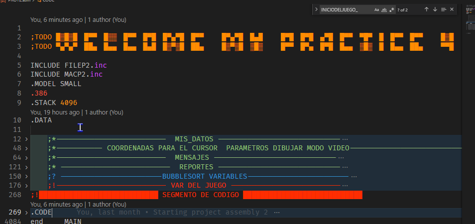

UNIVERSIDAD DE SAN CARLOS DE GUATEMALA

FACULTAD DE INGENIERIA

ESCUELA DE CIENCIAS Y SISTEMAS

LABORATORIO DE ARQUITECTURA DE COMPUTADORES Y ENSAMBLADORES 1

SEGUNDO SEMESTRE 2022

ING. OTTO RENE ESCOBAR LEIVA

TUTOR ACADEMICO SECCION A. OSCAR PERALTA

---

---

---

---

---

---

---

 <h1>PRACTICA #4</h1> 

 <h1>CALCULADORA</h1> 

---

---

---

---

| Nombre   |      Carnet      |  
|----------|:-------------:|
| Alvaro Emmanuel Socop Pérez | 202000194 | 

---

---

---

---

---

---

---

---

---

---

---

# MANUAL TECNICO
Programa desarrollado en Assembler que permite ste programa realiza operaci5ones aritmeticas (+, -, x, /) entre dos numeros enteros positivos O negativos exclusivamente en consola.

>“El manual técnico es el que proporciona todas las pautas de configuración y la lógica con la que se ha desarrollado en el programa, con el objetivo de que cualquier programador entienda la idea propia y su estructura; por lo que se considera necesario ser documentada.”
## ÍNDICE

| Topico | Link |
| ------ | ------ |
| Introducción | [Ir](#intro) |
| Objetivos y alcances del sistema | [Ir](#ob) |
| Especificaciones Técnicas | [Ir](#specs) |
| Requisitos de Hardware | [Ir](#req) |
| Requisitos de software | [Ir](#req2) |
| Sistema operativo | [Ir](#sisop) |
| Lenguaje de Programación e IDE | [Ir](#lengprog) |
| Tecnologías utilizadas (Lógica del programa) | [Ir](#tech) |
| Funciones utilizadas   | [Ir](#func) |
| Flujo del programa | [Ir](#flujo) |
| Conclusiones | [Ir](#Conclu) |

## INTRODUCCIÓN
El presente manual técnico tiene como finalidad describir la estructura y diseño del programa analizador de escritorio de un archivo XML, así como dar explicación de los métodos, clases y procesos de cada apartado del programa y la modificación que se le podría dar para cualquier finalidad como el de mejorar el sistema o cambiar algunos atributos propios del analizador. El sistema cuenta con implementación de varias librerías propias de python como re, ios, pathlab, entre otros, como parte del conocimiento adquirido en los laboratorios de programación de computadoras en base a ello trataré de explicar en que métodos se fueron utilizando y como hacen funcionar el programa en los distintos sistemas operativos.
La implementación de librerías externas a python también fueron una opción para poder pedir y abrir ventanas para elegir los archivos necesarios, también se explicará paso a paso cual es el camino para entender perfectamente la arquitectura del programa. Resulta ser bastante fácil de implementar los ciclos y condiciones, también los métodos de interfaces gráficas puesto que es una función que viene integrada con la paquetería por defecto de ASSEMBLER y así solo instanciarlos importando las librerías y utilizarlas.  

## Objetivos y alcances del sistema

### Objetivo General
- Que el estudiante aplique los conocimientos adquiridos en el curso sobre el lenguaje ensamblador

### Objetivos Específicos
- Aplicar el conocimiento de operaciones básicas a nivel ensamblador Conocer el funcionamiento de las interrupciones
- Comprender el uso de la memoria en los programas escritos en ensamblador Aplicar el manejo de archivos a bajo nivel
- Aplicar el uso de registros bandera
- Manejar entrada, proceso y salida de datos numéricos en - ensamblador Adquirir y aplicar conocimiento sobre manejo de - números 16 bits con signo.

## Especificaciones Técnicas

### Requisitos de Hardware
|  |  |
| ------ | ------ |
|Memoria mínima|	512 MB|
|Memoria recomendada |	1 GB|
|Espacio en disco mínimo|	250 MB de espacio libre  |
|Espacio en disco recomendado	|  500 MB de espacio libre|
|MVP	|Visual Studio Code y MASM instalados |

### Requisitos de software
## Sistema operativo 
Windows
•	Windows 10 (8u51 y superiors)
•	Tener instalado el programa de Proteus y Librerias de Arduino Code u otro editor
•	RAM: 128 MB
•	Espacio en disco: 124 MB 
•	Procesador: Mínimo Pentium 2 a 266 MHz 
•	Algún explorador de internet
Mac OS X 
•	Tener instalado el programa Proteus Code u otro editor
•	Explorador de 64 bits 
•	Se requiere un explorador de 64 bits (Safari, Firefox, por ejemplo) para ejecutar Oracle Java en Mac OS X.
Linux
•	Oracle Linux 5.5+1 
•	Oracle Linux 6.x (32 bits), 6.x (64 bits)2 
•	Exploradores: Firefox
•	Arduino
•	Proteus

## Lenguaje de Programación e IDE
Para el desarrollo del programa se utilizó el lenguaje de Programación C y el IDE Arduino y Visual Studio Code para el desarrollo de interfaz se utilizo Proteus 8.10

## Tecnologías utilizadas (Lógica del programa)
- Assembler es tipo de programa informático que se encarga de traducir un fichero fuente escrito en un lenguaje ensamblador, a un fichero objeto que contiene código máquina, ejecutable directamente por el microprocesador.

- MASM es El Microsoft Macro Assembler (MASM) es un ensamblador para la familia x86 de microprocesadores. Fue producido originalmente por Microsoft para el trabajo de desarrollo en su sistema operativo MS-DOS, y fue durante cierto tiempo el ensamblador más popular disponible para ese sistema operativo. 

## Funciones utilizadas 

## Flujo del programa
Tengo pantalla de bienvenida 

Luego muestro la pantalla de obtener las coordenadas de ambos jugadores

## Conclusiones

- Como conclusión podemos decir que el lenguaje ensamblador es mas que un tipo de lenguaje de bajo nivel en el cual es empleado para crear programas informáticos.

- •La importancia de este es que en el se pueden hacer cualquier tipo de programas que en otros lenguajes de alto nivel no, al igual que ocupan menos espacio en la memoria.

- Este lenguaje es creado a base de instrucciones para intentar sustituir al lenguaje maquina por uno similar utilizado por el hombre.

## Apéndice

;TODO █░█░█ █▀▀ █░░ █▀▀ █▀█ █▀▄▀█ █▀▀   █▀▄▀█ █▄█   █▀█ █▀█ ▄▀█ █▀▀ ▀█▀ █ █▀▀ █▀▀   █░█
;TODO ▀▄▀▄▀ ██▄ █▄▄ █▄▄ █▄█ █░▀░█ ██▄   █░▀░█ ░█░   █▀▀ █▀▄ █▀█ █▄▄ ░█░ █ █▄▄ ██▄   ▀▀█

INCLUDE MACROS.inc
INCLUDE ARCHIVOS.inc
.MODEL LARGE
.386
.STACK 4096
.DATA

    ;*--------------------------  MIS_DATOS -----------------------------
        tb1             DB   34,'HOLA! BIENVENIDO A MI CALCULADORA !!!!!!'
        tb2             DB   38,'Universidad de San Carlos de Guatemala'
        tb3             DB   22,'Facultad de Ingenieria'
        tb4             DB   30,'Escuela de Ciencias y Sistemas'
        tb5             DB   9,'Seccion A'
        tb6             DB   27,'ALVARO EMMANUEL SOCOP PEREZ'
        tb7             DB   9,'202000194'
        pressenter      DB   24,'ENTER: Para continuar...'
        ;*--------------------------     MENU    -----------------------------
        tm1             DB   29,'------- MENU PRINCIPAL ------'
        tm2             DB   14,'1. Calculadora'
        tm3             DB   10,'2. Archivo'
        tm4             DB   8,'3. Salir'
        tm1c             DB   '------- MENU PRINCIPAL ------',10, 13, "$"
        tm2c             DB   '         1. Iniciar Juego',10, 13, "$"
        tm3c             DB   '         2. Cargar Juego',10, 13, "$"
        tm4c             DB   '         3. Salir',10, 13, "$"
        CALCULADORATITLE DB     'CALCULADORA',10, 13, "$"
        otroseparador   db  " >  ", "$"
    ;*----------- COORDENADAS PARA EL CURSOR  PARAMETROS DIBUJAR MODO VIDEO-----------------------------
        BLACK               EQU  00H
        POSX            DB  ?
        POSY            DB  ?
        saltolinea      DB " ",10, 13, "$"
        X1              DW  ?
        X2              DW  ?
        Y1              DW  ?
        Y2              DW  ?
        KEY_PRESSED                     DB  ?
        keypress          DB ?
        keypresstempY          DB ?
        keypresstempX          DB ?
    ;*--------------------------  MENSAJES -----------------------------
        ingpath db "Ingrese la ruta path del archivo:", 10, 13, "$"
        textoprueba         DB "Textodeprueba","$"
        EXITO db "EXITO. ARCHIVO GUARDADO CON EXITO CARPETA BIN", 10, 13, "$"
        cargadoexito db "Cargado Exitosamente.", 10, 13, "$"
        lineaseparador db 223,223,223,223,223,223,223,223,223,223,223,223,223,223,223,223,223,223,223,223,223,223,223,223,223,223,223,223,223,223,223,223,223,223,223,223,223,223,223,223,223,223, 10, 13, "$"
        txtresult       DB 175,"  ", "$"
        txtenter        DB 10, 13, "$"
        txtminus        DB 45,"$"
        ESPAR DB "ESPARRRRRR", 10, 13, "$"
        ESIMPAR DB "ES IMPARRRRRR", 10, 13, "$"
    ;* --------------------------  PARA OPERACIONES -----------------------------
        op              DB      0H ;! El operador
        num1_int        DD      0H  ;! guarda los enteros
        num1_int_abs    DD      0H  ;!
        num1_dot        DW      0H;!guarda si hay un punto
        num1_dot_       DW      0H;!
        num1_fill       DB      0H ;!
        num1_sign       DB      1H;! guarda si hay signo
        num1_pow        DW      1H  ;! guarda si hay potencia
        num1_dot_detect DB      0H

        num2_int        DD      0H
        num2_int_abs    DD      0H
        num2_dot        DW      0H
        num2_dot_       DW      0H
        num2_fill       DB      0H
        num2_sign       DB      1H
        num2_pow        DW      1H
        num2_dot_detect DB      0H

        res_int         DD      0H  ;! resultado entero
        res_int1        DD      0H  ;! resultado entero
        res_dot         DW      0H  ;! resultado con punto decimal
        res_pow         DW      1H  ;! resultado de potencia

        ten             DW      0AH
        len             DW      0H
        tmp             DD      ?   ;! TEMPORALES PARA LAS RESPUESTAS
        tmp1            DD      ?
        tmp2            DD      ?
        tmp3            DD      ?
        tmp4            DD      ?
        NUMIZQSIN       db ?
        NUMDERSIN       db ?
        NUMIZQ          dw 00h  ;! numero izquierdo ya parseado
        NUMDER          dw 00h  ;! numero derecho ya parseado
        NumerosUltimos  DW ?
        ResultPosfijo   DW ?
        NUMTEMP   DB ? ;! temporal de solo numero STRING
        flagesnumero    DW  "0"
        flagsuma        DW  "0"
        flagresta        DW  "0"
        flagmulti        DW  "0"
        flagdivi        DW  "0"
        flagOP        DW  "0"
        flagOPAUX        DW  "0"
        flagpot        DW  "0"
        PARSEDNUM       DW ?
        INDEXRPF        DW ?
        overflow db 00h
        RESULTADOPREVIO   DW 0,'$'
        RESULTADOPRINT       dw 00h, '$'
        NUMCONVERTEMP       db ?
        CHAR       dW ?
        CHARNUM       dB ?
        tempstat       dB ?
        ;* almacenar los nombres de las operaciones
        listNumbers         db 2000 dup('$')
        CONTADORNumbers DW 0 ;!CONTADOR DE ID
        ;*almacenar los resultados de las operaciones
        listValues          dB 2000 dup('$')
        CONTADORValues  DW 0 ;! resultados de ID
        ;*almacenar los VALORES PARA ESTADISTICOS
        listestadistic          dw ? ;! ESTADISTICOS SE BASA EN ESTO RESETEAR
        DESORDENADA          DW ? ;! ESTADISTICOS SE BASA EN ESTO RESETEAR
        TAMANODEARRAY          dw ? ;! ESTADISTICOS SE BASA EN ESTO RESETEAR
        INDEXlistestadistic     DW ?

        TEMPBB DW ?
        TEMPBB1 DW ?
        TEMPBB2 DW ?
    ;* --------------------------  ESTADISTICOS -----------------------------
        NUMESFIB DW ?
        flagESPAR DW ?
        flagIMPAR DW ?
        flagESFIBONACCI DB ?
        mediaRES            dw 0,'$'
        contadornumerosmedia dw ?
        medianaRES          dw 0,'$'
        modaRES             dw 0,'$'
        cantparesRES              dw 0,'$'
        cantimparesRES              dw 0,'$'
        cantFIBOS              dw 0,'$'
        cantLUCAS              dw 0,'$'
    ;* --------------------------  REPORTES -----------------------------
        Filenamejug1  db  'Rep.xml'
        handlerentrada dw ?
        handlerentrada2 dw ?
        handler   dw ?
    ;* --------------------------  REPORTE XML -----------------------------
        HEADXML     db "<reporte>", 10, 13, 09,"<datos>", 10, 13, 09,09,"<nombre>ALVARO EMMANUEL SOCOP PEREZ</nombre>", 10, 13, 09,09,"<carnet>202000194</carnet>", 10, 13, 09,09,"$"
            HEADXML2     db "<curso>Arquitectura de computadores y ensambladores 1</curso>", 10, 13, 09,09,"<seccion>A</seccion>", 10, 13, 09,"</datos>", 10, 13, 09,"$"
            fechaxml        db "<fecha>", 10, 13, 09,09, "$"
            diaxml          db "<dia>",  "$"
            dia      db "00"
            diacxml          db "</dia>", 10, 13, 09,09, "$"
            mesxml          db "<mes>", "$"
            mes      db "00"
            mescxml          db "</mes>", 10, 13, 09,09, "$"
            anioxml         db "<anio>2022</anio>", 10, 13, 09, "$"
            fechacxml        db "</fecha>", 10, 13, 09, "$"
            ;tiempo
            tiempoxml           db "<tiempo>", 10, 13, 09,09, "$"
            horaxml             db "<hora>",  "$"
            minutoxml           db "<minuto>",  "$"
            segundoxml          db "<segundo>",  "$"
            tiempocxml           db "</tiempo>", 10, 13, 09, "$"
            horacxml            db "</hora>", 10, 13, 09,09, "$"
            minutocxml          db "</minuto>", 10, 13, 09,09, "$"
            segundocxml         db "</segundo>", 10, 13, 09, "$"
            hour        db "00"
            min         db "00"
            sec         db "00"
            ;estadisticos
            estadisticosxml     db "<estadisticos>", 10, 13, 09,09, "$"
            mediaxml            db "<media>",  "$"
            medianaxml          db "<mediana>",  "$"
            modaxml             db "<moda>",  "$"
            fibonaccixml        db "<fibonacci>",  "$"
            lucasxml            db "<lucas>",  "$"
            estadisticoscxml     db "</estadisticos>", 10, 13, 09, "$"
            mediacxml            db "</media>", 10, 13, 09,09,  "$"
            medianacxml          db "</mediana>", 10, 13, 09,09,  "$"
            modacxml             db "</moda>", 10, 13, 09,09,  "$"
            fibonaccicxml        db "</fibonacci>", 10, 13, 09,09,  "$"
            lucascxml            db "</lucas>", 10, 13, 09,  "$"
            ;operaciones
            operacionesxml      db "<operaciones>", 10, 13, 09,09, "$"
            operacionescxml     db "</operaciones>", 10, 13, 09, "$"
            reportecxml         db "</reporte>", 10, 13, 09, "$"
            

    
        SI_SIMULADO             DW ?
        SI_SIMULADO2             DW ?
        buffInfo db 20000 dup('$') ;! PARA REPORTE
        buffXML db 20000 dup('$')   ;! PARA ENTRADA
        date      db "dd/mm/2022  "
        time      db "00:00:00"
        h1Time    db '$'
        temp DW  ?
        
        file      db 50 dup('$')
        fileData  db 64 dup('$')
;!████████████████████████████ SEGMENTO DE CODIGO ████████████████████████████
.CODE

    main PROC FAR
        MOV AX, @DATA
        MOV DS, AX
        MOV ES, AX
        MOV INDEXlistestadistic,0 ;TODO: PARA RESET TAMBIEN
                                ; misdatos
                                ; esperaenter  ;TODO: activar despues
                                ; paint  0, 0, 800, 600, BLACK ;*LIMPIA TODO MODO VIDEO:V
                                ; menu
                                ; esperaenter
        limpiar
        readtext
            ; MOV NUMTEMP[0],"9"
            ; MOV NUMTEMP[1],"$"
            ; intToString NUMTEMP, PARSEDNUM
            ; MOV AX, PARSEDNUM
            MOV listestadistic[0], 9
            
            MOV listestadistic[2], 1
            
            MOV listestadistic[4], 8
            MOV listestadistic[6], 4
            
            MOV listestadistic[8], 2

            BUBBLESORT  8
            MOV AX,listestadistic[0]
            printnum RESULTADOPRINT, AX
            print RESULTADOPRINT
            MOV AX,listestadistic[2]
            printnum RESULTADOPRINT, AX
            print RESULTADOPRINT
            MOV AX,listestadistic[4]
            printnum RESULTADOPRINT, AX
            print RESULTADOPRINT
            MOV AX,listestadistic[6]
            printnum RESULTADOPRINT, AX
            print RESULTADOPRINT
            MOV AX,listestadistic[8]
            printnum RESULTADOPRINT, AX
            print RESULTADOPRINT
                                    ; ;* PRUEBA MEDIA
                                    ; MOV NUMTEMP[0],"2"
                                    ; MOV NUMTEMP[1],"5"
                                    ; MOV NUMTEMP[2],"0"
                                    ; MOV NUMTEMP[3],"0"
                                    ; MOV NUMTEMP[4],"$"
                                    ; intToString NUMTEMP, PARSEDNUM
                                    ; MOV AX, PARSEDNUM
                                    ; MOV listestadistic[0], AX
                                    ; MOV NUMTEMP[0],"1"
                                    ; MOV NUMTEMP[1],"0"
                                    ; MOV NUMTEMP[2],"0"
                                    ; MOV NUMTEMP[3],"0"
                                    ; MOV NUMTEMP[4],"$"
                                    ; intToString NUMTEMP, PARSEDNUM
                                    ; MOV AX, PARSEDNUM
                                    ; MOV listestadistic[2], AX
                                    ; MOV listestadistic[4], AX
                                    ; MOV contadornumerosmedia,6
                                    ; MEDIA
                                    ; printnum RESULTADOPRINT, mediaRES
                                    ; print RESULTADOPRINT
                            ; ;*PRUEBA PAR IMPAR
                            ; intToString NUMTEMP, PARSEDNUM
                            ; print EXITO
                            ; IMPARES PARSEDNUM
                            ; cmp flagESPAR, '1'
                            ; JNE IMPAR
                            ; JE PAR
                            ; PAR:
                            ; print ESPAR
                            ; JMP SIGO
                            ; IMPAR:
                            ; print ESIMPAR
                            ; SIGO:
            ; intToString NUMTEMP, PARSEDNUM
            ; POTENCIA PARSEDNUM,PARSEDNUM
            ; printnum RESULTADOPRINT, RESULTADOPREVIO
            ; print RESULTADOPRINT
        
        
        readtext
        ; ANALIZARYCALCULAR
        
        limpiar
        
        OPCIONDEMENU
        SALIDADEUNA:
            mov ax, 4c00h
            int 21h
            HLT ; para decirle al CPU que se estara ejecutando varias veces (detiene CPU hasta sig interrupcion)
            RET
    main    ENDP

    ;?☻ ===================== CONCATENAR TEXTO ENTRADA ======================= ☻
    readtext_ PROC NEAR
        xor di , di
        Leer:
            mov ax, 00
            mov ah, 01h
            int 21h
            cmp al, 32 ;! si hay un espacio no guardo nada OMITE
            je Leer
            cmp al, 08
            JE DELQUITAR
            JNE SEGUIR
            DELQUITAR:
                dec di
                mov keypress[di],"$"
            SEGUIR:
            cmp al, 13
            jne Concatenar
            je Salir
        Concatenar:
            mov keypress[di], al
            mov keypress[di + 1], "$"
            inc di
            jmp Leer
        Salir:
            ; ! ▓▓▓▓▓▓▓▓▓▓▓▓▒▒▒▒▒▒▒▒░░░░░░░░░ EN EL JUEGO  ░░░░░░░░░▒▒▒▒▒▒▒▒▓▓▓▓▓▓▓▓▓▓▓▓
            ; ! ▓▓▓▓▓▓▓▓▓▓▓▓▒▒▒▒▒▒▒▒░░░░░░░░░ EN EL JUEGO  ░░░░░░░░░▒▒▒▒▒▒▒▒▓▓▓▓▓▓▓▓▓▓▓▓
        QUEINGRESO:
                CMP keypress[0], "S"
                JNE GUARDAR
                JE ESS
            ESS:
                CMP keypress[1], "A"
                JNE GUARDAR
                JE ESA
            ESA:
                CMP keypress[2], "L"
                JNE GUARDAR
                JE ESL
            ESL:
                CMP keypress[3], "I"
                JNE GUARDAR
                JE ESIS
            ESIS:
                CMP keypress[4], "R"
                JNE GUARDAR
                JE SALIRAHORAYA
        GUARDARLISTO:
            ; limpiar
            ; poscursor 5, 15
            ; print ingpath
            ; getRuta file
            ; crear file,handler
            ; escribir handler,matriz2,SIZEOF matriz2 ;! GUARDO
            ; seekEnd handler
            ; escribir handler,matriz2,SIZEOF matriz2
            ; seekEnd handler
            ; escribir handler,barcos1,SIZEOF barcos1
            ; seekEnd handler
            ; escribir handler,barcos2,SIZEOF barcos2
            
            ; seekEnd handler
            ; escribir handler,NUMDISPAROTOT1,SIZEOF NUMDISPAROTOT1

            ; seekEnd handler
            ; escribir handler,NUMDISPAROTOT2,SIZEOF NUMDISPAROTOT2

            ; seekEnd handler
            ; escribir handler,NUMDISPAROFALL1,SIZEOF NUMDISPAROFALL1

            ; seekEnd handler
            ; escribir handler,NUMDISPAROFALL2,SIZEOF NUMDISPAROFALL2

            ; seekEnd handler
            ; escribir handler,NUMDISPAROBIEN1,SIZEOF NUMDISPAROBIEN1

            ; seekEnd handler
            ; escribir handler,NUMDISPAROBIEN2,SIZEOF NUMDISPAROBIEN2

            ; cerrar handler
            ; poscursor 10,20
            ; print EXITO
            ; readtext
            JMP NOPASANADAOIGA
        
        GUARDAR:
                CMP keypress[0], "G"
                JNE SHOWHTM
                JE ESG2
            ESG2:
                CMP keypress[1], "U"
                JNE SHOWHTM
                JE ESU2
            ESU2:
                CMP keypress[2], "A"
                JNE SHOWHTM
                JE ESA21
            ESA21:
                CMP keypress[3], "R"
                JNE SHOWHTM
                JE ESR21
            ESR21:
                CMP keypress[4], "D"
                JNE SHOWHTM
                JE ESD2
            ESD2:
                CMP keypress[5], "A"
                JNE SHOWHTM
                JE ESA22
            ESA22:
                CMP keypress[6], "R"
                JNE SHOWHTM
                JE GUARDARLISTO  ;TODO: VER A DONDE VOY A GUARDAR
        SHOWHTM:
                CMP keypress[0], "S"
                JNE NOPASANADAOIGA
                JE ESS3
            ESS3:
                CMP keypress[1], "H"
                JNE NOPASANADAOIGA
                JE ESH3
            ESH3:
                CMP keypress[2], "O"
                JNE NOPASANADAOIGA
                JE ES03
            ES03:
                CMP keypress[3], "W"
                JNE NOPASANADAOIGA
                JE ESW3
            ESW3:
                CMP keypress[4], "H"
                JNE NOPASANADAOIGA
                JE ESH33
            ESH33:
                CMP keypress[5], "T"
                JNE NOPASANADAOIGA
                JE EST3
            EST3:
                CMP keypress[6], "M"
                JNE NOPASANADAOIGA
                JE MOSTRARHTM  ;TODO: VER A DONDE VOY A MOSTRAR EL HTML
        SALIRAHORAYA:
            ; JMP SALIDADEUNA
            JMP NOPASANADAOIGA
        MOSTRARHTM:
            ; GENERARHTML1
            GENERARHTML1
        NOPASANADAOIGA:
        RET
    readtext_ ENDP
    ;?☻ ===================== OPCIONES DEL MENU ======================= ☻
    OPCIONDEMENU_ PROC NEAR
        INICIODEMENU:
        limpiar
        PRINTMENU ;! IMPRIME EL MENU
        readtext
        CMP keypress,'1'     ; si tecla es 1
        JNE CARGARXMLTEMP     ; sino es 1 se va a cargar
        JE CALCULOSIMPLE     ; SI SI ES SE VA A INICIARCALCULOS
        CARGARXMLTEMP:
            CMP keypress,'2'  ; si tecla es 2
            JNE SALIR ; sino es 2 se va a SALIR
            JE CARGARXML ; SI SI ES SE VA A CARGARJUEGO
        CARGARXML:
            limpiar
            cleanBuffer file
            cleanBuffer fileData
            cleanBuffer buffXML
            cleanBuffer buffInfo
            cleanBuffer listNumbers
            cleanBuffer listValues
            MOV CONTADORNumbers, 0
            MOV CONTADORValues, 0
            poscursor 10,15
            print ingpath
            poscursor 11, 10
            getRuta file

            openFile file, handler
            readFile handler, buffXML, SIZEOF buffXML
            cerrar handler
            poscursor 15,15
            print cargadoexito
            readtext
            ANALIZARARCHIVOENTRADA
            ADDTOSTATISTICSLIST
            print listNumbers
            readtext
            print listValues
            readtext
            jMP INICIODEMENU
        CALCULOSIMPLE:
            ; limpiar
            ; poscursor 1,30
            print CALCULADORATITLE
            print lineaseparador
            print otroseparador
            readtext
            ANALIZARYCALCULAR
            JMP CALCULOSIMPLE
        SALIR:
        RET
    OPCIONDEMENU_ ENDP
    ;?☻ ===================== CALCULO SIMPLE ======================= ☻
    ANALIZARYCALCULAR_ PROC NEAR
        MOV DI, 0 ;inicializo contador
        MOV BX, 0 ;inicializo contador 2
        MOV ax, '$'
        push ax
        ; MOV AH, keypress[DI]
        ; push AH ;? METO AL FONDO DE LA PILA EL CARACTER $
        ; ! agrego de NumerosUltimos a ResultPosfijo
        INICIO:
            cmp keypress[DI], "$"
            JE CALCULARHOYSI        ;! AQUI TERMINE DE ANALIZAR LA CADENA
            ESNUMERO keypress[DI] ;*es un numero?
            cmp flagesnumero, '1'
            JNE NOESNUMERO
            JE SIESNUMERO
            SIESNUMERO:
                MOV AH, keypress[DI]
                MOV NUMTEMP[BX], AH    ;* paso a numtemp el char que es numero
                INC BX
                ESNUMERO keypress[DI+1] ;*es un numero el siguiente?
                cmp flagesnumero, '1'
                JNE NOESNUMERONEXT
                JE SIESNUMERONEXT
                SIESNUMERONEXT:
                    INC DI      ;! siguiente posicion
                    JMP SIESNUMERO
                NOESNUMERONEXT:
                    MOV NUMTEMP[BX],'$'
                    ;! entonces guardo el numero que ya tengo y sigo
                    ;! NEcesito primero PARSEAR
                    intToString NUMTEMP, PARSEDNUM
                    MOV AX, PARSEDNUM
                    push AX ;? METO A LA PILA EL CARACTER DE PARSEDNUM
                    JMP SIGUIENTE
            NOESNUMERO:
                ESUNOPERADOR:
                    ESOP keypress[DI] ;*es un operador?
                    cmp flagsuma, '1'
                    JE GUARDOOPSUM
                    cmp flagresta, '1'
                    JE GUARDOOPRESTA
                    cmp flagmulti, '1'
                    JE GUARDOOPMULTI
                    cmp flagdivi, '1'
                    JE GUARDOOPDIVI
                    cmp flagpot, '1'
                    JNE PARENTESISABRE
                    JE GUARDOOPPOT
                    GUARDOOPSUM:
                        MOV AX, 43
                        push AX ;? METO A LA PILA EL CARACTER DE +
                        resetflagop
                        JMP SIGUIENTE
                    GUARDOOPRESTA:
                        MOV AX, 45
                        push AX ;? METO A LA PILA EL CARACTER DE -
                        resetflagop
                        JMP SIGUIENTE
                    GUARDOOPMULTI:
                        MOV AX, 42
                        push AX ;? METO A LA PILA EL CARACTER DE *
                        resetflagop
                        JMP SIGUIENTE
                    GUARDOOPDIVI:
                        MOV AX, 47
                        push AX ;? METO A LA PILA EL CARACTER DE /
                        resetflagop
                        JMP SIGUIENTE
                    GUARDOOPPOT:
                        MOV AX, 94
                        push AX ;? METO A LA PILA EL CARACTER DE ^
                        resetflagop
                        JMP SIGUIENTE

                PARENTESISABRE:
                    cmp keypress[DI],40
                    JNE PARENTESISCIERRA
                    JE GUARDAPARA
                    GUARDAPARA:
                        ;! GUARDO EL PARENTESIS EN  LA PILITA PREVIA
                        MOV AX, 40
                        push AX ;? METO A LA PILA EL CARACTER DE (
                        JMP SIGUIENTE
                PARENTESISCIERRA:
                    cmp keypress[DI],41
                    JNE SIGUIENTE
                    JE GUARDAPARC
                    GUARDAPARC:
                        ;! GUARDO EL PARENTESIS EN LA PILITA PREVIA
                        MOV AX, 41
                        push AX ;? METO A LA PILA EL CARACTER DE )
                        JMP SIGUIENTE
                SIGUIENTE:
                    INC DI      ;! siguiente posicion
                    JMP INICIO

            ;! ORDENO
        CALCULARHOYSI:
        ;! SI OPERO (5+5)*-3 tengo pila ==>  top: 3,-,*,),5,+,5,(,$ :fondo
            MOV DI, 0
            REORDENO:
                pop CX
                cmp CX, '$'
                JNE SINOESFONDO
                JE SIESFONDO
                SINOESFONDO:
                    MOV NumerosUltimos[DI], CX
                    INC DI
                    JMP REORDENO
                SIESFONDO: ;simplemente termine con la cadena y ya esta ordenada
                    MOV AX, '$'
                    MOV NumerosUltimos[DI], AX
                    JMP INICIOALGORITMOCOMPI
    ;TODO: HASTA AQUI LA PILA ESTA VACIA Y TODO ESTA EN NUMEROSULTIMOS
            ;! INICIO EL ALGORITMO FULL DE LA TABLA DE COMPI 1
        INICIOALGORITMOCOMPI:
            ;! RECORRO OTRA VEZ TODO :
            MOV DI,0 ; * PARA NUMEROSULTIMOS
            MOV SI,0 ; * PARA RESULTPOSFIJO

            RECORROALL:
                cmp NumerosUltimos[DI], "$"
                JE EJECUTARPOSFIJO
                ;! de NUMEROSULTIMOS debo agregar a RESULTPOSFIJO
                CLASIFYDIGITS NumerosUltimos[DI] 
                ;* flagOPAux tiene el tipo Actual
                ;* flagOP tiene el tipo anterior
                            ;? 0 ==> NO HAY OPERADORES EN LA PILA
                            ;? 1  ==>  SUMA O RESTA
                            ;? 2  ==>  MULTIP O DIVI
                            ;? 3  ==>  PARENTESIS ()
                            ;? 4  ==>  ES NUMERO    {OPERANDO}
                            ;? 5  ==>  ES POTENCIA   [ EL MAYOR ]
                CMP flagOPAux, '4'
                JE SIESOPERANDO
                CMP flagOPAux, '5'
                JE ESPRECEDENCIA5
                CMP flagOPAux, '3'
                JE ESPARENTESISPREC
                CMP flagOPAux, '2'
                JE ESPRECEDENCIA2
                CMP flagOPAux, '1'
                JE ESPRECEDENCIA1
                ;! agrego los signos al fondo de la pila
                    ;! Pero con restricciones:

                                        ;*El siguiente algoritmo convierte infijos en sufijos.

            

            

            ;* Si la precedencia del operador escaneado es mayor que el operador superior 
            ;* de la pila de operadores, inserte ese operador en la pila de operandos.

            

            ;*Si la precedencia del operador escaneado es menor o igual que el
            ;*operador superior de la pila de operadores, extraiga los operadores de la
            ;*pila de operandos hasta que encontremos un operador con una precedencia
            ;*más baja que el carácter escaneado. Nunca aparezca ( '(' ) o ( ')' ),
            ;*sea cual sea el nivel de prioridad del carácter escaneado.

            

            

            

                ;! SI SON OPERANDOS :
                ;*Si el carácter es un operando, empújelo a la pila de salida.
                SIESOPERANDO:;*Si es un operando, se guardara 
                                ;*directamente en el array o en un fichero. 
                    MOV AX, NumerosUltimos[DI]
                    MOV ResultPosfijo[SI], AX ;? TODOS LOS NUMEROS LOS AGREGO A POSFIJO
                    INC SI
                    INC DI
                    ; POP AX
                    ; CLASIFYDIGITS AX
                    ; MOV DX, flagOPAux
                    ; MOV flagOP, DX
                    ; PUSH AX
                    JMP RECORROALL
                ;! SI SON OPERADORES :
                ESPARENTESISPREC: ;? ████████████████  PARENTESIS █████████████████
                    cmp flagOP, '0' ; porque es el primer operando
                    JE APILOOP
                    cmp NumerosUltimos[DI], 40
                    JE ESPARENTESISQUEABRE
                    cmp NumerosUltimos[DI], 41
                    JE ESPARENTESISQUECIERRA
                    ESPARENTESISQUEABRE:
                        ;*Si un carácter abre un paréntesis ( '(' ), empújelo
                        ;*a la pila de sentencias.
                        JMP APILOOP
                    ESPARENTESISQUECIERRA:
                        ;! PASO A RESULTPOSFIJO HASTA HALLAR (
                        ;*Si un carácter cierra un paréntesis  ')' , extraiga sentencias de
                        ;*la pila de sentencias hasta que encontremos el paréntesis de apertura '(' .
                        pop AX
                        CMP AX, 40
                        JNE pasoaresultlodepila
                        JE PAROYA
                        PAROYA:
                            INC DI
                            POP AX ;* SACO EL QUE ESTA ANTES DEL PARENTESIS
                            cmp AX, '$'
                            JNE nohallegadotopedepila
                            JE llegoaltopedepila
                            nohallegadotopedepila:
                                CLASIFYDIGITS AX
                                MOV DX, flagOPAux
                                MOV flagOP, DX
                                PUSH ax
                                JMP RECORROALL
                            llegoaltopedepila:
                                MOV flagOP, '0'
                                JMP RECORROALL
                        pasoaresultlodepila:
                            MOV ResultPosfijo[SI], AX
                            INC SI
                            JMP ESPARENTESISQUECIERRA

                ESPRECEDENCIA5:  ;? ████████████████ POTENCIACION █████████████████
                    cmp flagOP, '0' ; porque es el primer operando
                    JE APILOOP
                    ;* Si la precedencia del operador escaneado es mayor que el operador superior       escaneado == flagOPAux
                    ;* de la pila de operadores, inserte ese operador en la pila de operandos.          superior == flagOP
                    cmp flagOP, '2'     ;! SI EN LA PILA ES 2
                    JE APILOOP
                    cmp flagOP, '1'     ;! SI EN LA PILA ES 1
                    JE APILOOP
                    cmp flagOP, '5'     ;! SI EN LA PILA ES 5
                    JE APILOOP

                    CMP flagOP, '3'
                    JE APILOOP

                    ;*Si la precedencia del operador escaneado es menor o igual que el
                    ;*operador superior de la pila de operadores, extraiga los operadores de la
                    ;*pila de operandos hasta que encontremos un operador con una precedencia
                    ;*más baja que el carácter escaneado.
                        ;! no hay mayor
                ESPRECEDENCIA2:  ;? ████████████████  MULTIPLICA DIVISION █████████████████
                    cmp flagOP, '0' ; porque es el primer operando
                    JE APILOOP
                    ;* Si la precedencia del operador escaneado es mayor que el operador superior       escaneado == flagOPAux
                    ;* de la pila de operadores, inserte ese operador en la pila de operandos.          superior == flagOP
                    ;! SE PRECEDENCIA ES MAYOR DEL QUE ESTA EN PILA
                    ;! ENTONCES SE APILA EL OPERADOR ACTUAL
                    cmp flagOP, '1'     ;! SI EN LA PILA ES 1
                    JE APILOOP
                    ;*Si la precedencia del operador escaneado es menor o igual que el
                    ;*operador superior de la pila de operadores, extraiga los operadores de la
                    ;*pila de operandos hasta que encontremos un operador con una precedencia
                    ;*más baja que el carácter escaneado.
                    cmp flagOP, '5'     ;! SI EN LA PILA ES 5
                    JE SIESMENORPREC
                    cmp flagOP, '2'     ;! SI EN LA PILA ES 2
                    JE SIESMENORPREC

                    CMP flagOP, '3'
                    JE APILOOP
                ESPRECEDENCIA1: ;? ████████████████  SUMA O RESTA █████████████████
                    cmp flagOP, '0' ; porque es el primer operando
                    JE APILOOP
                    ;* Si la precedencia del operador escaneado es mayor que el operador superior       escaneado == flagOPAux
                    ;* de la pila de operadores, inserte ese operador en la pila de operandos.          superior == flagOP
                    ;! no hay menor
                    ;*Si la precedencia del operador escaneado es menor o igual que el
                    ;*operador superior de la pila de operadores, extraiga los operadores de la
                    ;*pila de operandos hasta que encontremos un operador con una precedencia
                    ;*más baja que el carácter escaneado.
                    ;! SE PRECEDENCIA ES MENOR DEL QUE ESTA EN PILA
                    ;! ENTONCES SE PURGA LA CUMBRE DE LA PILA HASTA
                    ;! QUE NO LO SEA
                    cmp flagOP, '5'
                    JE SIESMENORPREC
                    cmp flagOP, '2'
                    JE SIESMENORPREC
                    cmp flagOP, '1'

                    JE SIESMENORPREC
                    CMP flagOP, '3'
                    JE APILOOP

                    SIESMENORPREC:
                        POP AX
                        MOV ResultPosfijo[SI], AX
                        INC SI
                        SIGUEYSIGUESIENDOMENOR:
                            POP AX ; saco el siguiente valor de la pila
                            CLASIFYDIGITS AX ; veo que tipo es
                            CMP flagOPAux, '1'
                            JNE YANOESMENOR
                            JE SIGUESIENDOMENOR; si sigue siendo menor
                            YANOESMENOR:
                                PUSH AX ;* IMPORTANTE DEVOLVER EL VALOR A PILA
                                INC DI    ; YA ME SALGO DE ESTA ITERACION
                                POP AX
                                CLASIFYDIGITS AX
                                MOV DX, flagOPAux
                                MOV flagOP, DX ; ! PA SABER QUE HAY EN BORDE
                                PUSH AX
                                JMP RECORROALL
                            SIGUESIENDOMENOR:
                                MOV ResultPosfijo[SI], AX
                                INC SI
                                JMP SIGUEYSIGUESIENDOMENOR
                
                ;! SI ES PRIMER OPERANDO ENTONCES APILO
                ;*Si el símbolo es una declaración y la pila de declaraciones
                ;*está vacía, inserte la declaración en la pila de declaraciones.  ya
                APILOOP:
                    MOV AX, NumerosUltimos[DI]
                    push AX
                    INC DI

                    POP AX              ;! -------- ACTUALIZO EL OPERADOR SIGUIENTE
                    CLASIFYDIGITS AX
                    MOV DX, flagOPAux
                    MOV flagOP, DX
                    PUSH AX             ;! --------
                    JMP RECORROALL

                ESIGUALPREC:
                    ; ! SI ES IGUAL PRECEDENCIA PASO DE LA PILA
                    ;! AL RESULTPOSFIJO
                    pop AX
                    MOV ResultPosfijo[SI], AX
                    INC SI
                    ;! Y AGREGO EL OPERADOR ACTUAL (AUX) A PILA
                    MOV AX, NumerosUltimos[DI]
                    push AX
                    INC DI
                    POP AX
                    CLASIFYDIGITS AX
                    MOV DX, flagOPAux
                    MOV flagOP, DX
                    PUSH AX
                    JMP RECORROALL

        ;! RECORRE Y EJECUTA LA CADENA EN POSFIJO.
        EJECUTARPOSFIJO:
            ;*Ahora extraiga las declaraciones restantes de la pila de declaraciones
            ;*y empújelas a la pila de salida.
            EXTRAER_DE_PILA: ;TODO:

            ;*teniendo ya la cadena en posfijo procedo a ejecutar 
            ;* las operaciones
            ;todo: TENGO LA PILA VACIA
            MOV AX, '$'
            PUSH AX
            MOV DI, 0
            RECORRERPOSFIJO:
                cmp ResultPosfijo[DI], '$'
                JNE SIGUIENTEDIGITOPOSFIJO ;?SINO
                JE TERMINORESULTPOSFIJO ;? SISI
                TERMINORESULTPOSFIJO: ; * AL TERMINAR LA CADENA POSFIJA RESULTADO FINAL ESTA EN POP AX
                    JMP SALIR
                SIGUIENTEDIGITOPOSFIJO:
                    ;! SI ES UN OPERADOR
                        ; SACO DE LA PILA 2 NUMEROS Y OPERO
                    ; Si es un operador, lo que haremos será sacar dos números reales de la
                    ; pila y les aplicaremos el operador sobre ellos. El resultado lo
                    ; meteremos en la pila. Hay que tener en cuenta a los operadores resta
                    ; y cociente (- y /) ya que en ocasiones no nos es indiferente el orden
                    ; de los números. Para ellos, el elemento que antes hubiese entrado en
                    ; la pila, es decir, el que sacamos en segundo lugar, será el que
                    ; aparezca a la izquierda del operador.
                    resetflagop
                    ESOP2 ResultPosfijo[DI]
                    cmp flagsuma, '1'
                    JE HAGOLA_SUMA
                    cmp flagresta, '1'
                    JE HAGOLA_RESTA
                    cmp flagmulti, '1'
                    JE HAGOLA_MULTIPLICACION
                    cmp flagdivi, '1'
                    JE HAGOLA_DIVISION
                    cmp flagpot, '1'
                    JNE SOLOAGREGOUNNUMERO
                    JE HAGOLA_POTENCIACION
                    HAGOLA_SUMA:
                        pop AX  ; JALO LOS ULTIMOS DE LA PILA.
                        pop CX
                        SUMA CX, AX    ; RESULTADO SE GUARDA EN RESULTADOPREVIO
                        MOV BX, RESULTADOPREVIO
                        PUSH BX           ; AGREGO EL RESULTADO A LA PILA
                        INC DI
                        JMP RECORRERPOSFIJO

                    HAGOLA_RESTA:
                        pop AX  ; JALO LOS ULTIMOS DE LA PILA.
                        pop CX
                        RESTA CX, AX    ; RESULTADO SE GUARDA EN RESULTADOPREVIO
                        MOV BX, RESULTADOPREVIO
                        PUSH BX           ; AGREGO EL RESULTADO A LA PILA
                        INC DI
                        JMP RECORRERPOSFIJO

                    HAGOLA_MULTIPLICACION:
                        pop AX  ; JALO LOS ULTIMOS DE LA PILA.
                        pop CX
                        MULTI CX, AX    ; RESULTADO SE GUARDA EN RESULTADOPREVIO
                        MOV BX, RESULTADOPREVIO
                        PUSH BX           ; AGREGO EL RESULTADO A LA PILA
                        INC DI
                        JMP RECORRERPOSFIJO

                    HAGOLA_DIVISION:
                        pop AX  ; JALO LOS ULTIMOS DE LA PILA.
                        pop CX
                        DIVI CX, AX    ; RESULTADO SE GUARDA EN RESULTADOPREVIO
                        MOV BX, RESULTADOPREVIO
                        PUSH BX           ; AGREGO EL RESULTADO A LA PILA
                        INC DI
                        JMP RECORRERPOSFIJO

                    HAGOLA_POTENCIACION:
                        pop AX  ; JALO LOS ULTIMOS DE LA PILA.
                        pop CX
                        POTENCIA CX, AX    ; RESULTADO SE GUARDA EN RESULTADOPREVIO
                        MOV BX, RESULTADOPREVIO
                        PUSH BX           ; AGREGO EL RESULTADO A LA PILA
                        INC DI
                        JMP RECORRERPOSFIJO

                    ;! SI ES UN NUMERO ADD TO STACK
                    ; Si es un número real, lo meteremos en la pila.
                    SOLOAGREGOUNNUMERO:
                        MOV AX, ResultPosfijo[DI]
                        push AX
                        INC DI
                        JMP RECORRERPOSFIJO
        SALIR:
        RET
    ANALIZARYCALCULAR_ ENDP 

    ;?☻ ===================== CALCULO ARCHIVO DE ENTRADA ======================= ☻
    ANALIZARARCHIVOENTRADA_ PROC NEAR
        MOV SI,0
        MOV DI,0
        MOV AX,0
        WHILES:
            mov dh, buffXML[si]
            cmp dh, "<"
            JNE BUSCOVALOR
            JE N
            N:
            mov dh, buffXML[si+1]
            cmp dh, "n"
            JNE BUSCOVALOR
            JE O
            O:
            mov dh, buffXML[si+2]
            cmp dh, "o"
            JNE BUSCOVALOR
            JE M
            M:
            mov dh, buffXML[si+3]
            cmp dh, "m"
            JNE BUSCOVALOR
            JE B
            B:
            mov dh, buffXML[si+4]
            cmp dh, "b"
            JNE BUSCOVALOR
            JE R
            R:
            mov dh, buffXML[si+5]
            cmp dh, "r"
            JNE BUSCOVALOR
            JE E
            E:
            mov dh, buffXML[si+6]
            cmp dh, "e"
            JNE BUSCOVALOR
            JE C1
            C1:
            mov dh, buffXML[si+7]
            cmp dh, ">"
            JNE BUSCOVALOR
            JE HALLONOMBRE

            HALLONOMBRE:
                ADD SI,8
                HALLONOMBRE2:
                MOV DH, buffXML[si]

                MOV DI, CONTADORNumbers ;*-------------
                MOV listNumbers[DI], DH
                INC DI
                MOV CONTADORNumbers, DI ;*-------------

                INC SI
                CMP buffXML[si], "<"
                JNE HALLONOMBRE2
                JE GUARDARNOMBRE
            GUARDARNOMBRE:
                MOV DI, CONTADORNumbers ;*-------------
                MOV listNumbers[DI], '&'
                INC DI
                MOV CONTADORNumbers, DI ;*-------------
                JMP WHILES
        BUSCOVALOR:
            mov dh, buffXML[si]
            cmp dh, "<"
            JNE CONTINUAR
            JE C2Q
            C2Q:
            mov dh, buffXML[si+1]
            cmp dh, "c"
            JNE CONTINUAR
            JE O2S
            O2S:
            mov dh, buffXML[si+2]
            cmp dh, "o"
            JNE CONTINUAR
            JE N999
            N999:
            mov dh, buffXML[si+3]
            cmp dh, "n"
            JNE CONTINUAR
            JE TIII
            TIII:
            mov dh, buffXML[si+4]
            cmp dh, "t"
            JNE CONTINUAR
            JE EHHHW
            EHHHW:
            mov dh, buffXML[si+5]
            cmp dh, "e"
            JNE CONTINUAR
            JE N777
            N777:
            mov dh, buffXML[si+6]
            cmp dh, "n"
            JNE CONTINUAR
            JE I888
            I888:
            mov dh, buffXML[si+7]
            cmp dh, "i"
            JNE CONTINUAR
            JE D444
            D444:
            mov dh, buffXML[si+8]
            cmp dh, "d"
            JNE CONTINUAR
            JE O222
            O222:
            mov dh, buffXML[si+9]
            cmp dh, "o"
            JNE CONTINUAR
            JE C22
            C22:
            mov dh, buffXML[si+10]
            cmp dh, ">"
            JNE CONTINUAR
            JE HALLOVALOR
            HALLOVALOR:
                ADD SI,11
                HALLOVALOR2:
                MOV AH, buffXML[si]
                cmp buffXML[si],' ' ;! osea si hay espacios en blanco no agregar
                JNE NOHAYESPACIOBLANCO
                JE SIHAYESPACIOBLANCO
                NOHAYESPACIOBLANCO:
                MOV DI, CONTADORValues ;*-------------
                MOV listValues[DI], AH
                INC DI
                MOV CONTADORValues, DI ;*-------------
                SIHAYESPACIOBLANCO:
                INC SI
                CMP buffXML[si], "<"
                JNE HALLOVALOR2
                JE GUARDARELVALOR
            GUARDARELVALOR:
                MOV DI, CONTADORValues ;*-------------
                MOV listValues[DI], '&'
                INC DI
                MOV CONTADORValues, DI ;*-------------
                JMP WHILES
        CONTINUAR:
            CMP buffXML[si],'$'
            JE FINARCHIVO
            INC SI
            JMP WHILES
        FINARCHIVO:
            MOV DI, CONTADORValues ;*-------------
            MOV listValues[DI], '$'
            INC DI
            MOV CONTADORValues, DI ;*-------------
            MOV DI, CONTADORNumbers ;*-------------
            MOV listNumbers[DI], '$'
            INC DI
            MOV CONTADORNumbers, DI ;*-------------
        RET
    ANALIZARARCHIVOENTRADA_ ENDP
    ADDTOSTATISTICSLIST_ PROC NEAR
        MOV SI,0
        MOV DI,0
        INICIO:
            CMP ListValues[SI],'$'
            JE SALIR
            ESNUMERO ListValues[SI]
            CMP flagesnumero, '1'
            JNE NELPRRO
            JE yesprro
            yesprro:
                MOV AH,  ListValues[SI]
                MOV tempstat[DI], ah
                inc di
                inc SI
                JMP INICIO
            NELPRRO:
                MOV tempstat[DI], '$'
                intToString tempstat, PARSEDNUM
                MOV AX, PARSEDNUM
                MOV DI, INDEXlistestadistic
                mov listestadistic[DI], AX
                INC DI
                INC DI
                MOV INDEXlistestadistic, DI
                MOV DI,0
                INC SI
                JMP INICIO

        SALIR:
        RET
    ADDTOSTATISTICSLIST_ ENDP
    
    ;! I CAN USE AX FOR THE LEFT NUMBER
    ;! I GONNA USE BX FOR THE RIGHT NUMBER
    ;?☻ ===================== SUMA ======================= ☻
    SUMA_ PROC NEAR
        MOV CX, NUMIZQ
        MOV BX, NUMDER
        MOV AX,CX   ;copy NUMIZQ to AX from CX
        MOV DX,00h
        ADD AX,BX   ;adding with NUMDER and guardo resultado en AX
        ADC AX,DX   ;adding CF (carry) to AX guardo resultado en AX
        MOV RESULTADOPREVIO, AX
        RET
    SUMA_ ENDP
    ;?☻ ===================== RESTA ======================= ☻
    RESTA_ PROC NEAR
        MOV CX, NUMIZQ
        MOV BX, NUMDER
        MOV AX,CX ;copy NUMIZQ to AX from CX
        SUB AX,BX ;subtracting NUMDER from NUMIZQ and 
        JC SOBREFLU; storing the result in AX 
        JNC SALIR
        SOBREFLU:
            NEG AX
            MOV overflow,01h
            RET
        SALIR:
        MOV RESULTADOPREVIO, AX
        RET
    RESTA_ ENDP
    ;?☻ ===================== MULTIPLICACION ======================= ☻
    MULTI_ PROC NEAR
        MOV CX, NUMIZQ
        MOV BX, NUMDER
        MOV AX,CX           ;copy NUMIZQ to AX from CX
        MOV DX,00H          ;moving 00h in DX
        MUL BX              ;multiplying NUMIZQ by NUMDER and storing the result in AX
        MOV RESULTADOPREVIO, AX
        RET
    MULTI_ ENDP
    ;?☻ ===================== DIVISION ======================= ☻
    DIVI_ PROC NEAR
        MOV CX, NUMIZQ
        MOV BX, NUMDER
        MOV AX,CX           ;copy NUMIZQ to AX from CX
        MOV DX,00H          ;moving 00h in DX 
        ADD BX,DX
        DIV BX              ;dividing NUMIZQ by NUMDER and storing the result in AX
        MOV RESULTADOPREVIO, AX
        RET
    DIVI_ ENDP
    ;?☻ ===================== POTENCIA ======================= ☻
    POTENCIA_ PROC NEAR
        MOV CX, NUMIZQ
        MOV BX, NUMDER
        MOV AX,CX   ;copy NUMIZQ to AX from CX
        MOV CX,BX   ;initializing CX with BX(NUMDER)
        ADD CX,00h
        JZ Lc
        SUB CX,01h  ;CX=CX-1;
        JZ SALIR    ;if CX = 0
        JNZ Lb      ;if CX != 0
        Lb:
            MOV BX,AX
            MOV DX,00h   ;moving 00h in DX
        L1:
            MUL BX   ;multiplying NUMIZQ by NUMIZQ and storing the result in AX
            LOOP L1
            JMP SALIR
        Lc:
            MOV AX,01h
        SALIR:
        MOV RESULTADOPREVIO, AX
        RET
    POTENCIA_ ENDP
    ;?☻ ===================== PARSEO ======================= ☻
    parser_ PROC NEAR
        MOV CX, 01d
        MOV BX, 00H
        MOV SI,0
        regreso:
            MOV AX, 00h
            MOV AL, NUMTEMP[SI] ;* lo que tengo en el segmento de datos
            MUL CX
            ADD BX,AX ;guardo la multiplicacion en BX
            MOV AX,CX; PARA INCREMENTAR POSICION DECIMAL
            INC SI; aumento posicion del numero STRING
            CMP NUMTEMP[SI],"$"
            JNE regreso ; sino ha llegado al final ...
            ;si llega al final...
            MOV PARSEDNUM,BX ;lo almaceno en direccion de parsednum
        RET
    parser_ ENDP

    ESOP_ PROC NEAR
        cmp CHARNUM, 42
        JE ESMULTI1
        cmp CHARNUM, 43
        JE ESSUM1
        cmp CHARNUM, 45
        JE ESREST1
        cmp CHARNUM, 47
        JE ESDIVI1
        cmp CHARNUM, 94
        JE ESPOT1
        
        BUSCOSUM:
            cmp NumerosUltimos[DI], 109
            JNE BUSCOREST
            JE BUSCOSUM1
            BUSCOSUM1:
                cmp NumerosUltimos[DI+1], 97
                JNE BUSCOREST
                JE BUSCOSUM2
            BUSCOSUM2:
                cmp NumerosUltimos[DI+2], 115
                JNE BUSCOREST
                JE ESSUM
        BUSCOREST:
            cmp NumerosUltimos[DI], 109
            JNE BUSCOMULTI
            JE BUSCOREST1
            BUSCOREST1:
                cmp NumerosUltimos[DI+1], 101
                JNE BUSCOMULTI
                JE BUSCOREST2
            BUSCOREST2:
                cmp NumerosUltimos[DI+2], 110
                JNE BUSCOMULTI
                JE BUSCOREST3
            BUSCOREST3:
                cmp NumerosUltimos[DI+3], 111
                JNE BUSCOMULTI
                JE BUSCOREST4
            BUSCOREST4:
                cmp NumerosUltimos[DI+4], 115
                JNE BUSCOMULTI
                JE ESREST
        BUSCOMULTI:
            cmp NumerosUltimos[DI], 112
            JNE BUSCODIVI
            JE BUSCOMULTI1
            BUSCOMULTI1:
                cmp NumerosUltimos[DI+1], 111
                JNE BUSCODIVI
                JE BUSCOMULTI2
            BUSCOMULTI2:
                cmp NumerosUltimos[DI+2], 114
                JNE BUSCODIVI
                JE ESDIVI
        BUSCODIVI:
            cmp NumerosUltimos[DI], 101
            JE BUSCODIVI1
            BUSCODIVI1:
                cmp NumerosUltimos[DI+1], 110
                JNE BUSCOPOT
                JE BUSCODIVI2
            BUSCODIVI2:
                cmp NumerosUltimos[DI+2], 116
                JNE BUSCOPOT
                JE BUSCODIVI3
            BUSCODIVI3:
                cmp NumerosUltimos[DI+3], 114
                JNE BUSCOPOT
                JE BUSCODIVI4
            BUSCODIVI4:
                cmp NumerosUltimos[DI+4], 101
                JNE BUSCOPOT
                JE ESDIVI
        BUSCOPOT:
            cmp NumerosUltimos[DI], 112
            JNE SALIR
            JE BUSCOPOT1
            BUSCOPOT1:
                cmp NumerosUltimos[DI+1], 111
                JNE SALIR
                JE BUSCOPOT2
            BUSCOPOT2:
                cmp NumerosUltimos[DI+2], 116
                JNE SALIR
                JE BUSCOPOT3
            BUSCOPOT3:
                cmp NumerosUltimos[DI+3], 101
                JNE SALIR
                JE BUSCOPOT4
            BUSCOPOT4:
                cmp NumerosUltimos[DI+4], 110
                JNE SALIR
                JE BUSCOPOT5
            BUSCOPOT5:
                cmp NumerosUltimos[DI+5], 99
                JNE SALIR
                JE BUSCOPOT6
            BUSCOPOT6:
                cmp NumerosUltimos[DI+6], 105
                JNE SALIR
                JE BUSCOPOT7
            BUSCOPOT7:
                cmp NumerosUltimos[DI+7], 97
                JNE SALIR
                JE ESPOT
        ESMULTI:
            MOV flagmulti, '1'
            INC DI
            INC DI
            JMP SALIR
        ESSUM:
            MOV flagsuma, '1'
            INC DI
            INC DI
            JMP SALIR
        ESREST:
            INC DI
            INC DI
            INC DI
            INC DI
            MOV flagresta, '1'
            JMP SALIR
        ESDIVI:
            INC DI
            INC DI
            INC DI
            INC DI
            MOV flagdivi, '1'
            JMP SALIR
        ESPOT:
            INC DI
            INC DI
            INC DI
            INC DI
            INC DI
            INC DI
            INC DI
            MOV flagpot, '1'
            JMP SALIR

        ESMULTI1:
            MOV flagmulti, '1'
            JMP SALIR
        ESSUM1:
            MOV flagsuma, '1'
            JMP SALIR
        ESREST1:
            MOV flagresta, '1'
            JMP SALIR
        ESDIVI1:
            MOV flagdivi, '1'
            JMP SALIR
        ESPOT1:
            MOV flagpot, '1'
            JMP SALIR
        SALIR:
        RET
    ESOP_ ENDP
    ESOP2_ PROC NEAR
        cmp CHAR, 42
        JE ESMULTI1
        cmp CHAR, 43
        JE ESSUM1
        cmp CHAR, 45
        JE ESREST1
        cmp CHAR, 47
        JE ESDIVI1
        cmp CHAR, 94
        JNE SALIR
        JE ESPOT1

        ESMULTI1:
            MOV flagmulti, '1'
            JMP SALIR
        ESSUM1:
            MOV flagsuma, '1'
            JMP SALIR
        ESREST1:
            MOV flagresta, '1'
            JMP SALIR
        ESDIVI1:
            MOV flagdivi, '1'
            JMP SALIR
        ESPOT1:
            MOV flagpot, '1'
            JMP SALIR
        SALIR:
        RET
    ESOP2_ ENDP
    CLASIFYDIGITS_ PROC NEAR
        cmp CHAR, 40
        JE ESPARA
        cmp CHAR, 41
        JE ESPARC
        cmp CHAR, 42
        JE ESMULTI1
        cmp CHAR, 43
        JE ESSUM1
        cmp CHAR, 45
        JE ESREST1
        cmp CHAR, 47
        JE ESDIVI1
        cmp CHAR, 94 ;* SINO ES NINGUN SIMBOLO ES NUMERO A LEY XD
        JNE ESNUMEROENTONCES
        JE ESPOT1
        ESPARA:
            ; MOV flagmulti, '3'
            MOV flagOPAux, "3"
            JMP SALIR
        ESPARC:
            ; MOV flagmulti, '3'
            MOV flagOPAux, "3"
            JMP SALIR
        ESMULTI1:
            ; MOV flagmulti, '1'
            MOV flagOPAux, "2"
            JMP SALIR
        ESSUM1:
            ; MOV flagsuma, '1'
            MOV flagOPAux, "1"
            JMP SALIR
        ESREST1:
            ; MOV flagresta, '1'
            MOV flagOPAux, "1"
            JMP SALIR
        ESDIVI1:
            ; MOV flagdivi, '1'
            MOV flagOPAux, "2"
            JMP SALIR
        ESPOT1:
            ; MOV flagpot, '1'
            MOV flagOPAux, "5"
            JMP SALIR
        ESNUMEROENTONCES:
            MOV flagOPAux, '4'
            JMP SALIR
        SALIR:
        RET
    CLASIFYDIGITS_ ENDP

    ESNUMERO_ PROC NEAR
        cmp CHARNUM, 48
        JE ESUNNUMERO
        cmp CHARNUM, 49
        JE ESUNNUMERO
        cmp CHARNUM, 50
        JE ESUNNUMERO
        cmp CHARNUM, 51
        JE ESUNNUMERO
        cmp CHARNUM, 52
        JE ESUNNUMERO
        cmp CHARNUM, 53
        JE ESUNNUMERO
        cmp CHARNUM, 54
        JE ESUNNUMERO
        cmp CHARNUM, 55
        JE ESUNNUMERO
        cmp CHARNUM, 56
        JE ESUNNUMERO
        cmp CHARNUM, 57
        JE ESUNNUMERO
        cmp CHARNUM, 58
        JNE NOESNUMERO
        JE ESUNNUMERO
        cmp CHARNUM, 59
        ESUNNUMERO:
            MOV flagesnumero, '1'
            JMP SALIR
        NOESNUMERO:
            MOV flagesnumero, '0'
            JMP SALIR
        SALIR:
        RET
    ESNUMERO_ ENDP

    ;*        █████████████████████████████████████████████████████████████████████
    ;*        █▄─▄▄─█─▄▄▄▄█─▄─▄─██▀▄─██▄─▄▄▀█▄─▄█─▄▄▄▄█─▄─▄─█▄─▄█─▄▄▄─██▀▄─██─▄▄▄▄█
    ;*        ██─▄█▀█▄▄▄▄─███─████─▀─███─██─██─██▄▄▄▄─███─████─██─███▀██─▀─██▄▄▄▄─█
    ;*        ▀▄▄▄▄▄▀▄▄▄▄▄▀▀▄▄▄▀▀▄▄▀▄▄▀▄▄▄▄▀▀▄▄▄▀▄▄▄▄▄▀▀▄▄▄▀▀▄▄▄▀▄▄▄▄▄▀▄▄▀▄▄▀▄▄▄▄▄▀

    ;? Los estadísticos se calculan sobre las entradas recibidas y no sobre los resultados, finales o parciales, de las operaciones.
    ;? Estadístico	       Observaciones
    ;? Media	        Salida parte entera
    ;? Mediana	        Salida parte entera Moda
    ;? Números          pares Números impares
    ;? Números          Fibonacci	Se debe calcular
    ;? Números Lucas	Se debe calcular

    MEDIA_ PROC NEAR
        ;*El promedio de la lista puede ser calculado simplemente
        ;*dividiendo la suma de los elementos por el número de elementos
        mov   si,0
        mov   ax, 0
        Whilezzz:
            mov ax, listestadistic[si]
            ADD mediaRES,ax
            inc si
            inc si
            cmp si, contadornumerosmedia
            je endWhilezzz
            jmp Whilezzz
        endWhilezzz:
            mov   bx, 0
            mov   ax, 0
            mov   ax, contadornumerosmedia
            mov   bx, 2
            cwd
            idiv  bx

            mov   bx, ax
            mov   ax, mediaRES
            cwd
            idiv  bx
            mov   mediaRES, ax
        SALIR:
        RET
    MEDIA_ ENDP

    MEDIANA_ PROC NEAR
        ;  se van sumando a pares, de manera que cada número es igual a la suma
        ;  de sus dos anteriores, de manera que: 0, 1, 1, 2, 3, 5, 8, 13, 21, 34, 55…
        MOV AX, 0
        MOV BX, 1
        push AX        ;! BX, AX
        push BX    ;* top [1, 0] fondo
        INICIO:
            POP BX
            POP AX
            MOV AX, BX
            ADD BX,AX
            CMP BX, NUMESFIB
            JE SONIGUALES
            JNE SIGOITERANDO
            SIGOITERANDO:
                cmp BX,NUMESFIB
                jb NOESFIBONACCI    ;Si el segundo es menor
                push AX
                push BX
                JMP INICIO
        SONIGUALES:
            MOV flagESFIBONACCI, "1"
            JMP SALIR
        NOESFIBONACCI:
            MOV flagESFIBONACCI, "0"
            JMP SALIR
        SALIR:
        RET

    MEDIANA_ ENDP
    MODA_ PROC NEAR
        ;  se van sumando a pares, de manera que cada número es igual a la suma
        ;  de sus dos anteriores, de manera que: 0, 1, 1, 2, 3, 5, 8, 13, 21, 34, 55…
        MOV AX, 0
        MOV BX, 1
        push AX        ;! BX, AX
        push BX    ;* top [1, 0] fondo
        INICIO:
            POP BX
            POP AX
            MOV AX, BX
            ADD BX,AX
            CMP BX, NUMESFIB
            JE SONIGUALES
            JNE SIGOITERANDO
            SIGOITERANDO:
                cmp BX,NUMESFIB
                jb NOESFIBONACCI    ;Si el segundo es menor
                push AX
                push BX
                JMP INICIO
        SONIGUALES:
            MOV flagESFIBONACCI, "1"
            JMP SALIR
        NOESFIBONACCI:
            MOV flagESFIBONACCI, "0"
            JMP SALIR
        SALIR:
        RET

    MODA_ ENDP
    IMPARES_ PROC NEAR
        mov dx,0
        mov ax,NUMESFIB
        mov bx,2
        div bx
        cmp DX,0d
        jz par
        jmp impar
        par:
            MOV flagESPAR, "1"
            INC cantparesRES
            JMP SALIR
        impar:
            MOV flagIMPAR, "0"
            INC cantimparesRES
            JMP SALIR
        SALIR:
        RET

    IMPARES_ ENDP
    FIBONACCI_ PROC NEAR
        ;  se van sumando a pares, de manera que cada número es igual a la suma
        ;  de sus dos anteriores, de manera que: 0, 1, 1, 2, 3, 5, 8, 13, 21, 34, 55…
        MOV AX, 0
        MOV BX, 1
        push AX        ;! BX, AX
        push BX    ;* top [1, 0] fondo
        INICIO:
            POP BX
            POP AX
            MOV AX, BX
            ADD BX,AX
            CMP BX, NUMESFIB
            JE SONIGUALES
            JNE SIGOITERANDO
            SIGOITERANDO:
                cmp BX,NUMESFIB
                jb NOESFIBONACCI    ;Si el segundo es menor
                push AX
                push BX
                JMP INICIO
        SONIGUALES:
            MOV flagESFIBONACCI, "1"
            JMP SALIR
        NOESFIBONACCI:
            MOV flagESFIBONACCI, "0"
            JMP SALIR
        SALIR:
        RET

    FIBONACCI_ ENDP
    LUCASLUCAS_ PROC NEAR
        ;  se van sumando a pares, de manera que cada número es igual a la suma
        ;  de sus dos anteriores, de manera que: 0, 1, 1, 2, 3, 5, 8, 13, 21, 34, 55…
        MOV AX, 2
        MOV BX, 1
        push AX        ;! BX, AX
        push BX    ;* top [1, 0] fondo
        INICIO:
            POP BX
            POP AX
            MOV AX, BX
            ADD BX,AX
            CMP BX, NUMESFIB
            JE SONIGUALES
            JNE SIGOITERANDO
            SIGOITERANDO:
                cmp BX,NUMESFIB
                jb NOESFIBONACCI    ;Si el segundo es menor
                push AX
                push BX
                JMP INICIO
        SONIGUALES:
            MOV flagESFIBONACCI, "1"
            JMP SALIR
        NOESFIBONACCI:
            MOV flagESFIBONACCI, "0"
            JMP SALIR
        SALIR:
        RET

    LUCASLUCAS_ ENDP

    BUBBLESORT_ PROC NEAR
        MOV SI, -2
        MOV DI, -2
        ILOOP:       ;* for i in range(0,len(list1)-1):
            INC SI
            INC SI
            JLOOP:  ;* for j in range(len(list1)-1)
                INC DI
                INC DI
                CONDITION:          ;*if(list1[j]>list1[j+1]):

                    MOV AX, listestadistic[DI]
                    MOV BX, listestadistic[DI+2]
                    CMP AX,BX
                    JG MAYORQUE
                    JMP JLOOP_
                    MAYORQUE:
                        MOV AX, listestadistic[DI]    ;*temp = list1[j]
                        MOV TEMPBB, AX
                        MOV AX, listestadistic[DI+2]
                        MOV listestadistic[DI], AX   ;*list1[j] = list1[j+1]
                        MOV AX, TEMPBB
                        MOV listestadistic[DI+2], AX  ;*list1[j+1] = temp
                        
                        JMP JLOOP_
        JLOOP_:
            CMP DI, 8
            JNE JLOOP
            JE ILOOPS_
        ILOOPS_:
            MOV DI,0
            cmp SI, 8
            JNE ILOOP
            JE SALIR

        SALIR:
        RET
    BUBBLESORT_ ENDP

    PRINTMENU_ PROC NEAR
        poscursor 6,22
        print tm1c
        poscursor 8,22
        print tm2c
        poscursor 10,22
        print tm3c
        poscursor 12,22
        print tm4c
        poscursor 16,29
        RET
    PRINTMENU_ ENDP
    ;?☻ ===================== POSICIONAR EL CURSOR ======================= ☻
    poscursor_ PROC NEAR
        ; FUNCION COLOCAR CURSOR
        mov ah, 02h ; FUNCION PARA COLOCAR EL CURSOR
        mov dh, POSX ; 12 FILA
        mov dl, POSY ; 12 COLUMNA
        INT 10h
        RET
    poscursor_ ENDP
    ;? ☻ ===================== METODO MOSTRAR DATOS ======================= ☻
    misdatos_     PROC NEAR
        MOV AX,4F02H           ;SETEAMOS EL MODO VIDEO INT 10   800*600
        MOV BX,103H
        INT 10H
        ; imprimo el texto de inicio
        PAINTTEXT tb1 , 0820H , 0FF22H
        PAINTTEXT tb2 , 0F10h , 0FF0FH
        PAINTTEXT tb3 , 1210H , 0FF0FH
        PAINTTEXT tb4 , 1410H , 0FF0FH
        PAINTTEXT tb5 , 1610H , 0FF0FH
        PAINTTEXT tb6 , 1810H , 0FF0FH
        PAINTTEXT tb7 , 1A10H , 0FF0FH
        PAINTTEXT pressenter , 2125H , 0FF30H
        RET
    misdatos_     ENDP
    ;?☻ ===================== METODO MOSTRAR DATOS ======================= ☻
    menu_     PROC NEAR
        PAINTTEXT tm1 , 0820H , 0FF26H
        PAINTTEXT tm2 , 0F10h , 0FF0FH
        PAINTTEXT tm3 , 1210H , 0FF0FH
        PAINTTEXT tm4 , 1410H , 0FF0FH
        RET
    menu_     ENDP
    ;?☻ ===================== METODO IMPRIMIR ======================= ☻
    PAINTTEXT_    PROC NEAR
        MOV AX,1301H
        MOV BX,BP
        MOV CL,[BX]
        MOV CH,00H
        ADD BP,1H
        MOV BX,SI
        INT 10H
        RET
    PAINTTEXT_    ENDP
    ;?☻ ===================== PRESIONAR TECLAS ======================= ☻
    enterclick_    PROC    NEAR
        esperar:
            esperatecla
            MOV AH , keypress
            CMP AH, 1CH
        JNE esperar
        RET
    enterclick_    ENDP

    esperatecla_  PROC   NEAR
        MOV keypress, AH
        RET
    esperatecla_ ENDP

    ;?☻ ===================== DIBUJAR EN PANTALLA ======================= ☻
    paint_   PROC  NEAR
        ;PARAMETERS
        ; X1, Y1, X2, Y2, AL = COLOR
        INC X2
        INC Y2  ;TO STOP AT X2 + 1, Y2 + 1
        MOV DX, Y1
        MOV AH, 0CH   ;AH = 0C FOR INT, AL = COLOR
        DRAW_ALL_RECTANGLE_ROWS:
        MOV CX, X1
            DRAW_RECTANGE_ROW:
                INT 10H
                INC CX
                CMP CX, X2
            JNZ DRAW_RECTANGE_ROW
        INC DX
        CMP DX, Y2
        JNZ DRAW_ALL_RECTANGLE_ROWS
        RET
    paint_ ENDP
    ;!  █▀█ █▀▀ █▀█ █▀█ █▀█ ▀█▀ █▀
    ;!  █▀▄ ██▄ █▀▀ █▄█ █▀▄ ░█░ ▄█
    ; * ☻☻☻☻☻☻☻☻☻☻☻☻☻☻☻☻☻☻☻☻☻☻☻☻☻☻ GENERACION DE REPORTES
    GENERARHTML1_ PROC NEAR
        MOV SI_SIMULADO,0
        MOV SI_SIMULADO2,0
        getDate
        getTime
        concatenarHTML buffInfo, HEADXML
        concatenarHTML buffInfo, HEADXML2
        concatenarHTML buffInfo, fechaxml

        concatenarHTML buffInfo, diaxml
        concatenarHTML buffInfo, dia
        concatenarHTML buffInfo, diacxml
        concatenarHTML buffInfo, mes
        concatenarHTML buffInfo, mescxml
        concatenarHTML buffInfo, anioxml
        concatenarHTML buffInfo, fechacxml

        concatenarHTML buffInfo, tiempoxml
        concatenarHTML buffInfo, horaxml
        concatenarHTML buffInfo, hour
        concatenarHTML buffInfo, horacxml
        concatenarHTML buffInfo, minutoxml
        concatenarHTML buffInfo, min
        concatenarHTML buffInfo, minutocxml
        concatenarHTML buffInfo, segundoxml
        concatenarHTML buffInfo, sec
        concatenarHTML buffInfo, segundocxml
        concatenarHTML buffInfo, tiempocxml
        concatenarHTML buffInfo, estadisticosxml
        concatenarHTML buffInfo, mediaxml

        concatenarHTML buffInfo, mediacxml
        concatenarHTML buffInfo, medianaxml

        concatenarHTML buffInfo, medianacxml
        concatenarHTML buffInfo, modaxml

        concatenarHTML buffInfo, modacxml
        concatenarHTML buffInfo, fibonaccixml

        concatenarHTML buffInfo, fibonaccicxml
        concatenarHTML buffInfo, lucasxml

        concatenarHTML buffInfo, lucascxml
        concatenarHTML buffInfo, estadisticoscxml
        ; concatenarHTML buffInfo, FINHTM
        concatenarHTML buffInfo, operacionesxml
        ;all the responses
        concatenarHTML buffInfo, operacionescxml
        concatenarHTML buffInfo, reportecxml

        crear Filenamejug1, handlerentrada
        escribir  handlerentrada, buffInfo, SIZEOF buffInfo
        cerrar handlerentrada
        RET
    GENERARHTML1_ ENDP
    convert proc
        aam
        add ax, 3030h
        ret
    convert endp
end     MAIN
;*  ░█████╗░██╗░░░░░██╗░░░██╗░█████╗░██████╗░░█████╗░    ░██████╗░█████╗░░█████╗░░█████╗░██████╗░
;*  ██╔══██╗██║░░░░░██║░░░██║██╔══██╗██╔══██╗██╔══██╗    ██╔════╝██╔══██╗██╔══██╗██╔══██╗██╔══██╗
;*  ███████║██║░░░░░╚██╗░██╔╝███████║██████╔╝██║░░██║    ╚█████╗░██║░░██║██║░░╚═╝██║░░██║██████╔╝
;*  ██╔══██║██║░░░░░░╚████╔╝░██╔══██║██╔══██╗██║░░██║    ░╚═══██╗██║░░██║██║░░██╗██║░░██║██╔═══╝░
;*  ██║░░██║███████╗░░╚██╔╝░░██║░░██║██║░░██║╚█████╔╝    ██████╔╝╚█████╔╝╚█████╔╝╚█████╔╝██║░░░░░
;*  ╚═╝░░╚═╝╚══════╝░░░╚═╝░░░╚═╝░░╚═╝╚═╝░░╚═╝░╚════╝░    ╚═════╝░░╚════╝░░╚════╝░░╚════╝░╚═╝░░░░░
